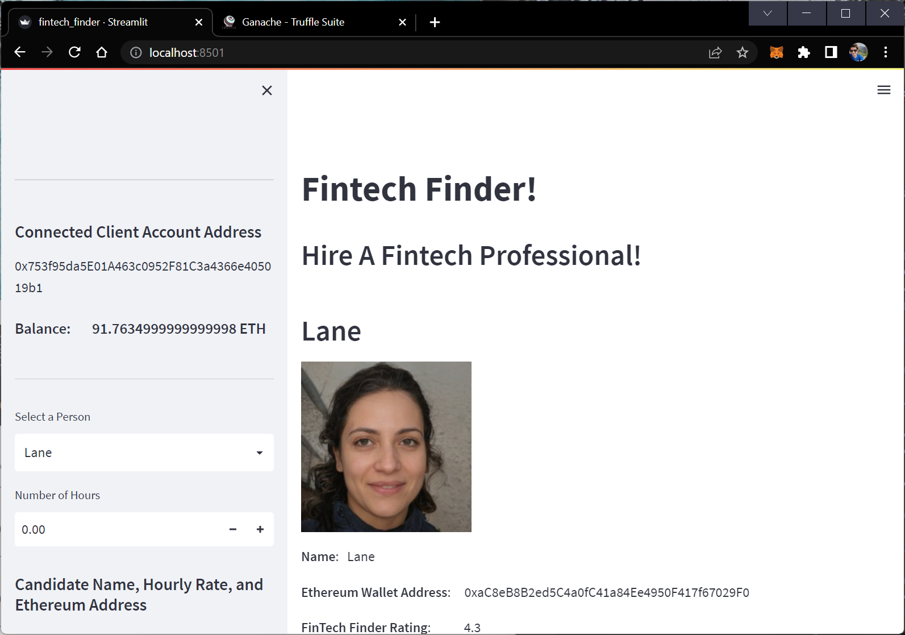
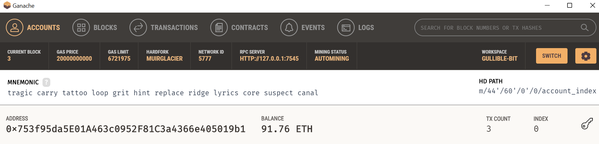
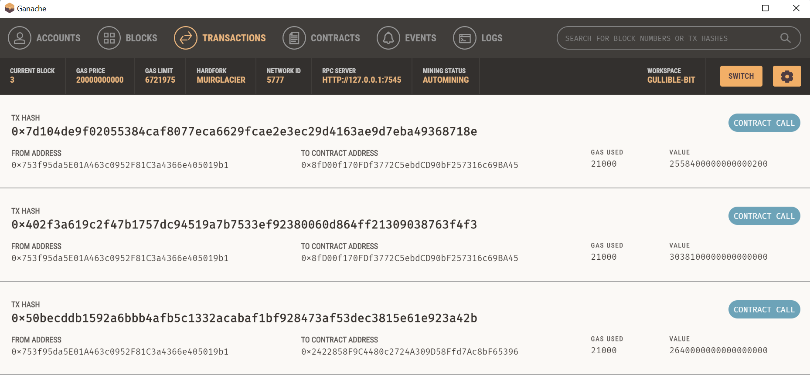
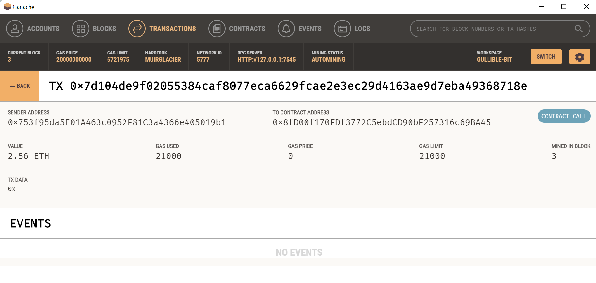

# Paying Fintech Professionals using blockchain accessible through a Streamlit UI
> Application for finding fintech professionals, hiring them, and paying them with ethereum stored on a local ganache blockchain.


An application for browsing through a list of Fintech Professionals and being able to pay their required hourly-rate using a locally hosted blockchain based on ethereum.  This application offers the following functionality:

1) Connecting to a client's ethereum wallet address.
2) Selecting a Fintech Professional for hire from a database.
3) Specifying the client's requirements for hourly work and calculating a corresponding wage for the selected Fintech Professional.
4) Paying the Fintech Professional their wage in Ethereum and outputing the successful transaction's hash to the streamlit interface.

---
## Technologies

The helper python functions are constructed using ```Python 3.7.11```.  The local ethereum blockchain is hosted by ```Ganache 2.5.4```.  The web app and user interface is designed and powered by ```Streamlit 1.11.0```.

---

## Installation Guide

Before running the application, first install streamlit if you don't already have the package installed in your development environment.

```python
  pip install streamlit
```

You will also need the Ganache test ethereum block chain to be installed on your local computer.  To install, navigate to [https://trufflesuite.com/ganache/](https://trufflesuite.com/ganache/) and follow the installation instructions for installing on your local computer.

All other imported packages used in this application are standard packages already included in the standard python and anaconda libraries.

---

## Usage

Before using the application, open your Ganache application and run a local Ganache blockchain.  By default, the local server's address is ```HTTP://127.0.0.1:7545```.  
After the chain is initialized, take note of the MNEMONIC key phrase for the test wallet.  This will be the wallet used for the client of this web applicaiton.  Copy this MNEMONIC key phrase into an empty ```.env``` file and paste it in quotes after typing ```MNEMONIC = ```.  Save this ```.env``` file to the top directory of your cloned repo.

To use the application, the fintech finder application can be initialized by opening a terminal and navigating to the top directory of the repository.  The application can be initialized using streamlit by typing the following command:
```python
streamlit run fintech_finder.py
```
Streamlit will initialize an instance of the application in your local environment and can be viewed in your default webbrowser.  Upon opening, the application window should look like the screenshot below:



Once initialized, you can scroll through the list of Fintech Professionals.  Once finding one you would like to hire, select the name of the professional in the side margin.  Then select the number of hours you will need to complete the job.

Based on your selection, the applicaiton populates the total wage in Ether required to hire the Fintech professional.

At the bottom of the sidebar, you can press the ```Send Transaction``` button to send Ethereum from your wallet to the fintech professional's wallet.  Streamlit will output the hash of a successful transaction.

To verify that your transactions went through, you can open up Ganache.  

The wallet at the top line is your wallet and corresponding wallet's balance.  Your wallet balance should match 100 ETH minus any payments sent to your Fintech professionals. The number of transactions is also listed under ```Tx COUNT```.  An example can be seen below:



The transactions can be observed by heading to the transactions tab in Ganache.  In this demonstration, three transactions were sent to various Fintech Professionals:



Each individual transaction can be clicked and more details can be found for each transation.  An example below:



As you can see, the streamlit application correctly sends signed transactions from a client to a requested service provider using a test ethereum blockchain.  Ganache can save this blockchain for future deployment and testing using the same streamlit applicaiton.


## Data Sources

The seed code for this Fintech Finder application is provided by the course materials from a UCBerkeley Fintech Extension program.  

---

## Contributors

The seed code is from the course material from a UCBerkeley Extension program.  This streamlit application is written by John Gruenewald.<br><br>
For more information, contact **John Gruenewald**:<br>
**e-mail:** [john.h.gruenewald@gmail.com](mailto:john.h.gruenewald@gmail.com)<br> **linked-in:**  [jhgruenewald](https://www.linkedin.com/in/jhgruenewald/)<br>**twitter:**  [@GruenewaldJohn](https://twitter.com/GruenewaldJohn)<br>**medium:**  [@comput99](https://medium.com/@comput99)

---

## License

MIT License

Copyright (c) 2022 John Gruenewald